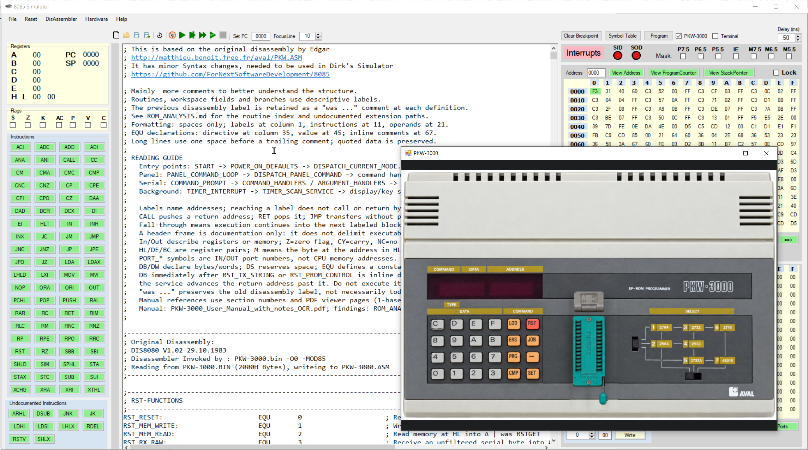

# 8085
Intel 8085 Assembler / Disassembler / Simulator

This is an assembler/disassembler for the Intel-8085 microprocessor.
It can also simulate an Intel SDK-85 developers board (keyboard/display).
This fork is intended to add simulation of PKW-3000 (keboard/display/serial?)

The PKW-3000 simulation is now available through **Hardware > PKW-3000**.
When switching to PKW-3000, choose Yes to load and assemble the bundled adapted
`pkw2_8085.asm`, based on Edgar's original-ROM disassembly. Then use Run/Fast/Step.
The dialog lists its changes: the "Hellorld!" terminal greeting, ASCII Hex Space
transfer format (X6=4), and printable S/X start/end markers (X8=53, X9=58).
A nonempty ASM editor requires a separate OK/Cancel confirmation before replacement.
Choose No to open and assemble your own PKW ASM in the main window instead.
The hardware window contains the front panel from manual page 1-4. Use the Terminal checkbox
then JOB, E, SET on the device.
See [the implementation plan, findings, test instructions and handover](docs/PKW-3000.md).

Copyright (c) 2022 Dirk Prins

Permission is hereby granted, free of charge, to any person obtaining a copy of this software and associated documentation files (the "Software"), to deal in the Software without restriction, including without limitation the rights to use, copy, modify, merge, publish, distribute, sublicense, and/or sell copies of the Software, and to permit persons to whom the Software is furnished to do so, subject to the following conditions:

The above copyright notice and this permission notice shall be included in all copies or substantial portions of the Software.

THE SOFTWARE IS PROVIDED "AS IS", WITHOUT WARRANTY OF ANY KIND, EXPRESS OR IMPLIED, INCLUDING BUT NOT LIMITED TO THE WARRANTIES OF MERCHANTABILITY, FITNESS FOR A PARTICULAR PURPOSE AND NONINFRINGEMENT. IN NO EVENT SHALL THE AUTHORS OR COPYRIGHT HOLDERS BE LIABLE FOR ANY CLAIM, DAMAGES OR OTHER LIABILITY, WHETHER IN AN ACTION OF CONTRACT, TORT OR OTHERWISE, ARISING FROM, OUT OF OR IN CONNECTION WITH THE SOFTWARE OR THE USE OR OTHER DEALINGS IN THE SOFTWARE.

Realtime runs PKW-3000 at its nominal 3 MHz rate with reset and breakpoint support.
File > Load Binary loads CPU memory directly while retaining the selected hardware;
source-less code is shown in a bounded live disassembly. Save Binary preserves
zero bytes and assembled address ranges. See [branch integration notes](docs/BRANCH-INTEGRATION.md)
for the integrated CPU corrections, tests and known DSUB flag limitation.
